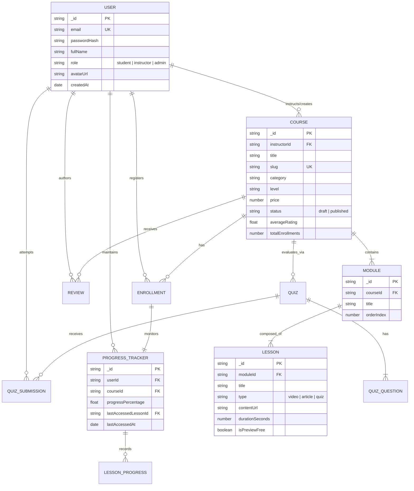
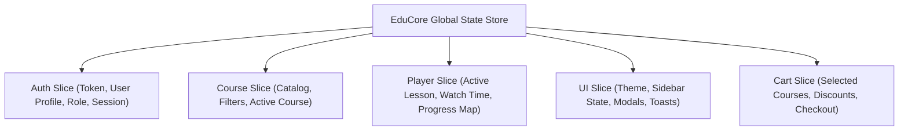

# EduCore - Enterprise Learning Management System (LMS)
> **Capstone Phase 1 Blueprint: Product Requirements, System Architecture, & UI/UX Design**
> **Repository:** `prodesk-capstone-educore` | **Designated Track:** Full Stack Web Development (MERN / TypeScript)

---

## 1. Executive Summary & Product Overview
**EduCore** is an enterprise-grade Learning Management System (LMS) engineered to scale modern organizational workforce upskilling and university-level online pedagogy. EduCore unifies video course streaming, multi-tier curriculum management, real-time student progress tracking, interactive assessments, and instructor analytics into a responsive web application.

---

## 2. Technical Stack Matrix

| Layer | Technologies Selected | Rationale & Enterprise Justification |
| :--- | :--- | :--- |
| **Frontend Framework** | **Next.js 14 (App Router) + React 18** | SSR/SSG for SEO-critical course catalogs, fast client-side transitions for learning dashboards. |
| **Language** | **TypeScript (Strict Mode)** | Full end-to-end type safety across domain models, state stores, and API contracts. |
| **Styling & Design System** | **Tailwind CSS + Shadcn UI + Radix UI** | Accessible primitives (WAI-ARIA compliant), responsive layout tokens, and dark mode theming. |
| **State Management** | **Zustand / Redux Toolkit** | Granular state separation across Authentication, Course Browsing, and Video Player runtime. |
| **Backend & Runtime** | **Node.js + Express / Next.js Server Actions** | Non-blocking I/O optimized for handling high-frequency telemetry and progress sync payloads. |
| **Database** | **MongoDB + Mongoose** | Flexible document model accommodating hierarchical modules, lessons, and nested quiz structures. |
| **Auth & Security** | **JWT (Access + Refresh Tokens) + bcrypt** | Stateless multi-role authentication (Student, Instructor, Admin) with RBAC route guards. |
| **Cloud Storage** | **AWS S3 / Cloudinary** | Scalable, high-bandwidth object storage for course thumbnails, attachments, and HLS video feeds. |

---

## 3. Product Requirements & Core Feature Matrix (MoSCoW)

### Phase 1: Base MVP (P0 - Mandatory Deliverables)
* [x] **Secure Auth & RBAC**: Multi-role user registration and login (Student, Instructor, Admin) backed by JWT and encrypted passwords.
* [x] **Curriculum & Course Engine**: Creation and retrieval of courses partitioned into hierarchical Modules and chronological Lessons.
* [x] **Student Enrollment Engine**: One-click registration binding students to courses with immediate access provisioning.
* [x] **High-Fidelity Learning Player**: Multi-format content viewer (video stream player, markdown reader, resource download panel).
* [x] **Real-Time Progress Synchronization**: Deterministic tracking of watched seconds, lesson completion flags, and overall course progress percentage.

### Phase 2: Priority 1 Features (Architectural Enhancements)
* [x] **Interactive Quizzes & Automated Grading**: In-course assessments with instant scoring, passing thresholds, and answer breakdown.
* [x] **Instructor Revenue & Engagement Dashboard**: Analytics measuring total enrollments, completion rates, and average course ratings.
* [x] **Curriculum Builder**: Drag-and-drop course creation suite with rich text editing and media upload workflows.
* [x] **Automated Certificate Generation**: Dynamic generation of verifiable PDF completion certificates upon achieving 100% course progress.

### Phase 3: Priority 2 Features & Stretch Goals
* [ ] **Live Discussion Threads & Real-Time Q&A**: WebSockets-driven peer-to-instructor Q&A per lesson.
* [ ] **Stripe Payment Gateway Integration**: Webhook-verified checkout flow supporting multi-currency payments and discount coupons.
* [ ] **AI-Powered Learning Assistant**: Embedded LLM tutor answering student queries grounded in current lesson transcripts.

---

## 4. UI/UX Wireframes & Visual DOM Specification

* **Public Figma Workspace**: [EduCore LMS Wireframe Canvas](https://www.figma.com/file/educore-enterprise-lms-blueprint) *(Public View / Comment Enabled)*
* Detailed design tokens, component breakdown, and responsive breakpoints are documented in [`docs/wireframes/README.md`](./docs/wireframes/README.md).

### Core Viewport Previews

#### 1. Authentication Viewport
Split-screen hero layout featuring social proof, role toggles (`Student` vs `Instructor`), inline input validation, and OAuth SSO triggers.
```
+--------------------------------------+--------------------------------------+
| [ BRAND HERO & SOCIAL PROOF ]        | [ AUTHENTICATION CARD ]              |
|  * EduCore Logo & Tagline            |  [ Tab: Sign In ] | [ Tab: Sign Up ] |
|  Active Students: 120,000+           |  Role: (o) Student   ( ) Instructor  |
|  Completion Rate: 94.8%              |  Email & Password Inputs             |
|                                      |  [ ====== SIGN IN TO EDUCORE ====== ]|
+--------------------------------------+--------------------------------------+
```

#### 2. Main Dashboard (Student Learning Hub)
Command center displaying key learning metrics, one-click course resumption, and personalized skill recommendations.
```
+-------------+---------------------------------------------------------------+
| NAVIGATION  | WELCOME ALEX | [ENROLLED: 4] [HOURS: 38.5] [CERTIFICATES: 2]  |
| [Dashboard] | IN PROGRESS COURSES (RESUME LEARNING)                         |
| [My Courses]| > Advanced Microservices with Go & Kafka                      |
| [Quizzes]   | [=============================>-----------] 72% Complete      |
| [Settings]  |                                      [ RESUME LESSON -> ]     |
+-------------+---------------------------------------------------------------+
```

#### 3. Course Details & Video Learning Viewport
Split-pane media interface with 75% video viewport and 25% collapsible module-lesson tree.
```
+----------------------------------------------------+------------------------+
| VIDEO PLAYER / CONTENT VIEWPORT (75% Width)        | CURRICULUM SYLLABUS    |
| [> Play] [08:14 / 24:30] [1.25x] [HD] [Fullscreen] | Module 1: Foundations  |
| Lesson 4.2: Event-Driven State Streams             | [x] 1.1 Intro (12m)    |
| [Overview] [Resources & Code] [Notes] [Discussion] | Module 2: Kafka Engine |
|                                                    | [>] 2.2 Event Sourcing |
+----------------------------------------------------+------------------------+
```

---

## 5. System Architecture: Fullstack Entity Relationship Diagram (ERD)

The complete MongoDB relational structure models 1:N and N:M relationships with indexing for optimal read/write query latency:


*Full schema details and compound indexing strategies available in [`docs/architecture/erd.md`](./docs/architecture/erd.md).*

---

## 6. Frontend Global State Tree & API Contract

### Global Store Architecture (Zustand / Redux Toolkit)


### Standardized Mock REST API Endpoints

| Method | Endpoint | Access Role | Description |
| :--- | :--- | :--- | :--- |
| `POST` | `/api/v1/auth/register` | Public | Register new user account |
| `POST` | `/api/v1/auth/login` | Public | Authenticate credentials & issue JWT pair |
| `GET` | `/api/v1/courses` | Public | Query paginated course catalog with filters |
| `GET` | `/api/v1/courses/:slug` | Public | Retrieve syllabus and course overview |
| `POST` | `/api/v1/courses/:id/enroll` | Student | Register student into a course |
| `GET` | `/api/v1/learn/:courseId` | Enrolled Student | Load full curriculum and progress tracking state |
| `POST` | `/api/v1/learn/progress` | Enrolled Student | Sync watched seconds and lesson completion |
| `POST` | `/api/v1/quizzes/:id/submit` | Enrolled Student | Submit assessment for automated scoring |
| `GET` | `/api/v1/instructor/analytics` | Instructor | Retrieve enrollment, completion, and revenue metrics |

*Full API schema definitions and payload contracts are documented in [`docs/architecture/state-and-api.md`](./docs/architecture/state-and-api.md).*

---

## 7. Git Repository & Directory Layout

```text
prodesk-capstone-educore/
├── README.md                      # Comprehensive PRD & System Overview
├── .gitignore                     # Production ignore rules
├── docs/
│   ├── architecture/
│   │   ├── erd.md                 # Fullstack MongoDB Relational Schema & Indexes
│   │   └── state-and-api.md       # Frontend State Tree & REST API Contracts
│   └── wireframes/
│       └── README.md              # Figma Links & Viewport DOM Layout Specifications
```

---

## 8. Git Initial Commit Verification

To push this repository to GitHub under the required naming convention:
```bash
git remote add origin https://github.com/[YOUR-USERNAME]/prodesk-capstone-educore.git
git branch -M main
git push -u origin main
```
