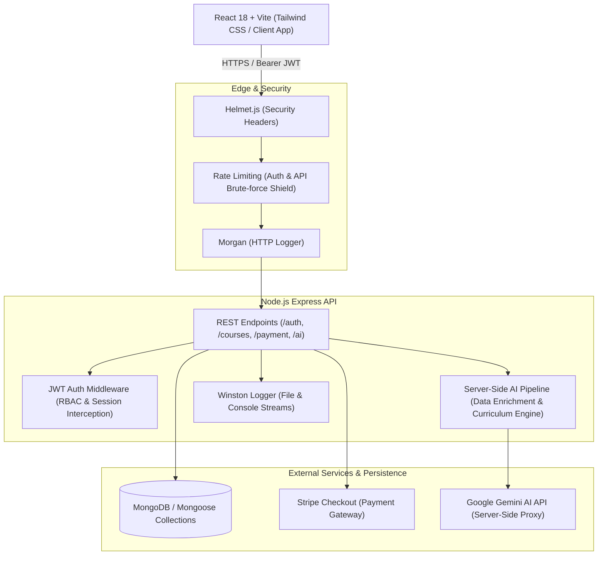

# EduCore - Enterprise Learning Management Cloud

EduCore is a cloud-native, enterprise-grade Learning Management System (LMS) designed for workforce technical upskilling, curriculum orchestration, and monetized training delivery. Built with React, Node.js, Express, MongoDB, and Stripe, EduCore provides modern engineering teams with a unified platform for authoring, distributing, and consuming certified technical training.

---

## Architecture Overview



---

## Core Features

- **Enterprise Authentication & Access Control (RBAC)**:
  - Cryptographic salting and hashing with `bcryptjs` (salt rounds = 10, zero plain-text storage).
  - Stateless JSON Web Token (JWT) session lifecycle with automatic client-side route guards.
  - Role-based separation for **Learners**, **Instructors**, and **Administrators**.

- **Curriculum & Course Management**:
  - Full RESTful CRUD operations on courses with categories, levels, pricing, and syllabi.
  - **Strict Data Ownership Enforcement**: Server-level authorization policies guarantee only the verified course author or an administrator can modify or delete course materials.
  - **Optimistic UI Deletion**: Real-time client updates filter deleted items instantaneously with automatic rollback on network or permission failure.

- **Automated AI Data Enrichment**:
  - Server-side AI pipeline automatically analyzes course descriptions upon creation to infer semantic tags, craft 2-sentence executive summaries, and define skill outcomes.
  - Zero exposure of AI provider credentials to client-side code.
  - On-demand AI syllabus generation for instructors.

- **Monetized Course Enrollment**:
  - Integrated with **Stripe Checkout** for multi-currency payment processing.
  - Automated post-transaction confirmation and lifetime access provisioning.

- **Production Security & Observability**:
  - **Helmet.js** protection for secure HTTP response headers (XSS, CSP, nosniff, frameguard).
  - **Rate Limiting** via `express-rate-limit` protecting against brute-force credential stuffing.
  - Structured logging with **Winston** and **Morgan**, persisting to `logs/combined.log` and `logs/error.log`.
  - Health check probe endpoint (`GET /api/health`) for containerized orchestration (Render, Railway, Kubernetes).

---

## Technology Stack

| Layer | Technologies |
| :--- | :--- |
| **Frontend** | React 18, Vite, React Router v6, Tailwind CSS, Lucide Icons, Axios |
| **Backend** | Node.js (ESM), Express.js, Mongoose, MongoDB |
| **Security & Auth** | JWT (`jsonwebtoken`), `bcryptjs`, `helmet`, `express-rate-limit` |
| **Logging & Ops** | Winston, Morgan, Multi-stage Dockerfile |
| **Payment Gateway** | Stripe SDK (Stripe Checkout) |
| **AI Integration** | Google Gemini API (Server-Side Proxy) |

---

## Project Structure

```text
.
├── Dockerfile                         # Production multi-stage container build
├── Procfile                           # PaaS process file (Render / Railway)
├── client/                            # React 18 Single-Page Application
│   ├── src/
│   │   ├── components/                # Reusable UI widgets & Course modals
│   │   ├── context/                   # AuthContext for session management
│   │   ├── pages/                     # Login, Register, Dashboard, PaymentSuccess
│   │   ├── services/                  # Axios instance with 401 interceptors
│   │   ├── App.jsx                    # Routing table and ProtectedRoute guards
│   │   └── index.css                  # Tailwind styles
│   └── package.json
├── server/                            # Node.js Express REST API
│   ├── logs/                          # Persisted combined.log & error.log
│   ├── src/
│   │   ├── config/                    # Database (db.js) & Winston (logger.js)
│   │   ├── controllers/               # Auth, Course, Payment controllers
│   │   ├── middleware/                # JWT Auth guard & Rate limiters
│   │   ├── models/                    # Mongoose schemas (User, Course)
│   │   ├── routes/                    # API routes (/auth, /courses, /payment, /ai)
│   │   ├── services/                  # Server-side AI intelligence engine
│   │   └── server.js                  # Main server entrypoint
│   ├── test/                          # Unit & integration test suites
│   └── package.json
└── README.md
```

---

## Getting Started

### Prerequisites
- Node.js (v18 or higher recommended)
- npm (v9 or higher)
- MongoDB instance (local or MongoDB Atlas URI; falls back automatically to embedded in-memory database in development)

### 1. Clone & Setup Environment

```bash
git clone https://github.com/[YOUR-USERNAME]/prodesk-capstone-educore.git
cd prodesk-capstone-educore
```
### 2. Local Development

#### Start Backend API
```bash
cd server
npm install
npm start
```
The server runs on **`http://localhost:5000`** with live health monitoring at `http://localhost:5000/api/health`.

#### Start Frontend Client
Open a second terminal window:
```bash
cd client
npm install
npm run dev
```
The React application boots at **`http://localhost:5173`**.

---

## Automated Verification & Test Suites

The backend includes standalone verification scripts covering cryptographic integrity, data ownership authorization policies, and production logging:

```bash
cd server

# 1. Cryptographic Security & JWT Verification
node test/crypto.test.js

# 2. Strict Data Ownership & Authorization Policy
node test/ownership.test.js

# 3. Winston File Logging & AI Enrichment Pipeline
node test/ai-logging.test.js
```

To verify the client production bundle:
```bash
cd client
npm run build
```

---

## Deployment

### Containerized Deployment (Docker)
Build and run the unified container:
```bash
docker build -t educore-lms .
docker run -p 5000:5000 -e JWT_SECRET=production_secret educore-lms
```

### Cloud Platform Deployment (Render / Railway)
1. Push the repository to GitHub.
2. Link the repository to your Render or Railway dashboard.
3. Configure the environment variables (`JWT_SECRET`, `MONGO_URI`, `STRIPE_SECRET_KEY`, `GEMINI_API_KEY`).
4. Set build command to `cd server && npm install && cd ../client && npm install && npm run build` or select **Dockerfile**.
5. Set start command to `cd server && npm start`.

---

## License
MIT License. © 2026 EduCore Technologies Inc.
