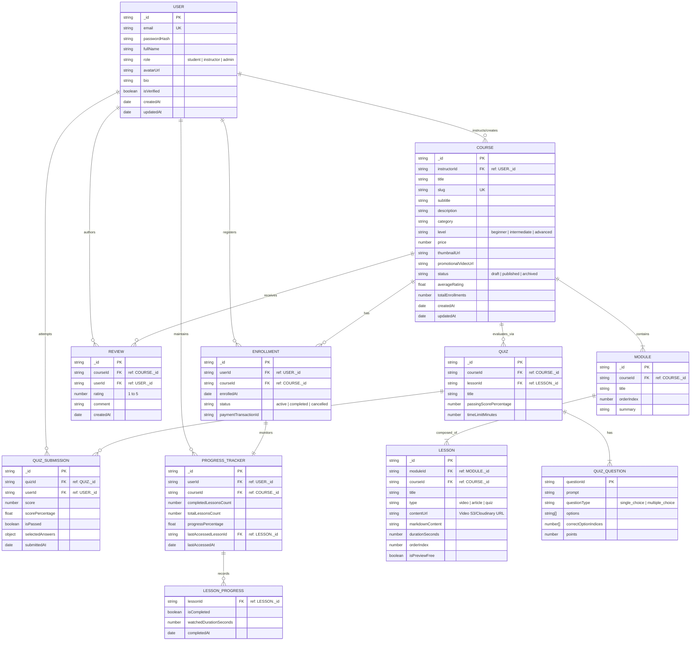

# Architecture & Data Models - EduCore LMS

## 1. Fullstack Entity Relationship Diagram (ERD) - MongoDB

EduCore adopts a hybrid schema design combining normalized document references for high-cardinality collections (`Enrollment`, `QuizSubmission`, `Review`) and bounded embedding for cohesive entities (`Curriculum Modules` -> `Lessons`, `Quiz Questions`).

---

## 2. MongoDB Schema Invariants & Design Principles

1. **Denormalization for Fast Dashboard Reads**:
   - `COURSE` stores `averageRating` and `totalEnrollments` updated asynchronously upon review creation or enrollment commit.
   - `PROGRESS_TRACKER` calculates `progressPercentage` on lesson completion to avoid costly table scans across lesson collections during student portal loading.
2. **Access Control & Multi-Tenancy**:
   - Every read and write to protected course assets queries role permissions (`student`, `instructor`, `admin`) validated against JWT tokens.
3. **Compound Indexes**:
   - `Enrollment`: `{ userId: 1, courseId: 1 }` (Unique compound index preventing duplicate enrollments).
   - `ProgressTracker`: `{ userId: 1, courseId: 1 }` (Fast user-course resume queries).
   - `Lesson`: `{ moduleId: 1, orderIndex: 1 }` (Ordered sequence resolution).
