# Frontend State Architecture & API Contract - EduCore LMS

## 1. Frontend Global State Tree (Zustand / Redux Toolkit)

The global state is partitioned into isolated domain stores to guarantee deterministic rendering, avoid unnecessary re-renders, and ensure high modularity.

```mermaid
graph TD
    RootStore["EduCore Global State Store"]

    RootStore --> AuthState["Auth Slice (useAuthStore)"]
    RootStore --> CourseState["Course Catalog Slice (useCourseStore)"]
    RootStore --> PlayerState["Player & Learning Slice (usePlayerStore)"]
    RootStore --> UIState["UI / Layout Slice (useUIStore)"]
    RootStore --> CartState["Cart & Checkout Slice (useCartStore)"]

    %% Auth Details
    AuthState --> A1["user: UserProfile | null"]
    AuthState --> A2["token: string | null"]
    AuthState --> A3["role: 'student' | 'instructor' | 'admin'"]
    AuthState --> A4["isAuthenticated: boolean"]
    AuthState --> A5["login() / logout() / refreshSession()"]

    %% Course Details
    CourseState --> C1["courses: CourseSummary[]"]
    CourseState --> C2["selectedCourse: CourseDetail | null"]
    CourseState --> C3["filters: { category, level, sort, query }"]
    CourseState --> C4["pagination: { page, limit, totalPages }"]
    CourseState --> C5["fetchCourses() / fetchCourseBySlug()"]

    %% Player Details
    PlayerState --> P1["activeLesson: Lesson | null"]
    PlayerState --> P2["curriculum: ModuleWithLessons[]"]
    PlayerState --> P3["playback: { currentTime, duration, isPlaying, playbackRate }"]
    PlayerState --> P4["progressMap: Record<lessonId, LessonStatus>"]
    PlayerState --> P5["markLessonComplete() / updateWatchTime()"]

    %% UI Details
    UIState --> U1["theme: 'light' | 'dark' | 'system'"]
    UIState --> U2["sidebarCollapsed: boolean"]
    UIState --> U3["activeModal: 'quiz' | 'review' | 'login' | null"]
    UIState --> U4["toastQueue: ToastNotification[]"]

    %% Cart Details
    CartState --> K1["items: CartItem[]"]
    CartState --> K2["appliedCoupon: Coupon | null"]
    CartState --> K3["subtotal: number"]
    CartState --> K4["addToCart() / removeFromCart() / checkout()"]
```

---

## 2. Mock API RESTful Contract Specification

All endpoints follow strict JSON API standard specifications:

| Method | Endpoint | Access Role | Description | Payload / Query | Response (200/201) |
| :--- | :--- | :--- | :--- | :--- | :--- |
| `POST` | `/api/v1/auth/register` | Public | Register new user account | `{ fullName, email, password, role }` | `{ user, token }` |
| `POST` | `/api/v1/auth/login` | Public | Authenticate user credentials | `{ email, password }` | `{ user, token, refreshToken }` |
| `GET` | `/api/v1/auth/me` | Authenticated | Retrieve current session profile | Headers: `Bearer <token>` | `{ user }` |
| `GET` | `/api/v1/courses` | Public | Paginated course discovery list | `?page=1&limit=10&category=&search=` | `{ courses: [], total, page }` |
| `GET` | `/api/v1/courses/:slug` | Public | Full course syllabus & info | None | `{ course: { ..., modules: [] } }` |
| `POST` | `/api/v1/courses` | Instructor, Admin | Create a new course draft | `{ title, subtitle, category, price }` | `{ courseId, slug }` |
| `POST` | `/api/v1/courses/:id/enroll` | Student | Enroll user in a course | `{ paymentMethodId }` | `{ enrollmentId, status: 'active' }` |
| `GET` | `/api/v1/learn/:courseId` | Enrolled Student | Fetch active curriculum & progress | None | `{ curriculum: [], progress: {} }` |
| `POST` | `/api/v1/learn/progress` | Enrolled Student | Sync lesson completion / watch time | `{ courseId, lessonId, watchedSeconds, completed }` | `{ progressPercentage, completed }` |
| `POST` | `/api/v1/quizzes/:id/submit`| Enrolled Student | Submit quiz answers for grading | `{ answers: { [questionId]: [0] } }` | `{ score, isPassed, details }` |
| `GET` | `/api/v1/instructor/analytics`| Instructor | Performance metrics & revenue | `?range=30d` | `{ totalStudents, revenue, trends: [] }` |
